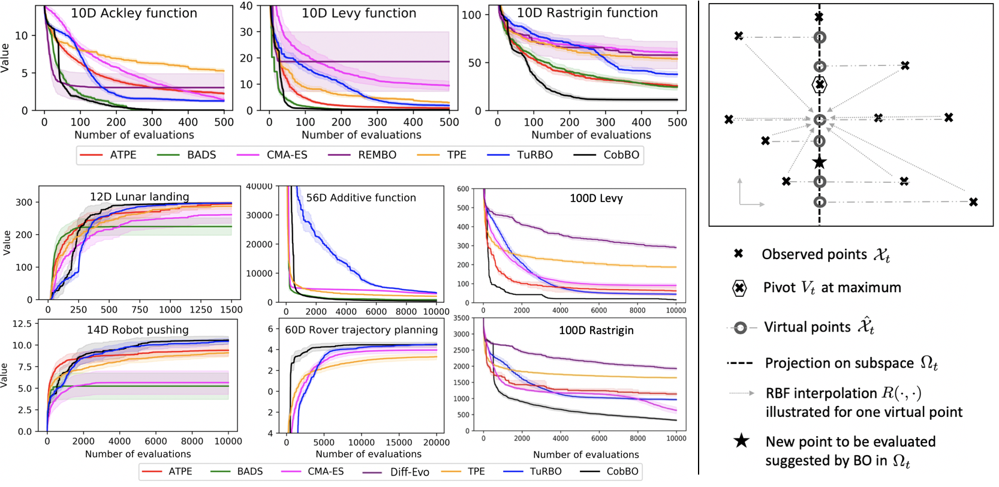

# CobBO: Coordinate Backoff Bayesian Optimization
Code accompanying the paper:
> [CobBO: Coordinate Backoff Bayesian Optimization](https://arxiv.org/abs/2101.05147)\
> Jian Tan, Niv Nayman, Mengchang Wang, Jin Rong.\
> _arXiv:2101.05147_.

CobBO is a gradient-free Bayesian optimization method, excelling at the maximization of 10 to 300 dimensional black box functions.
CobBO captures a smooth approximation of the global landscape of black box functions by interpolating the values of 
queried points projected to randomly selected promising coordinate subspaces. Thus also a smaller query budget is 
required for Gaussian process regressions applied over the lower dimensional subspaces.
This approach can be viewed as a variant of coordinate descent, tailored for Bayesian optimization, using a stopping
rule for backing off from a certain subspace and switching to another coordinate subset.
Additionally, adaptive trust regions are dynamically formed to expedite the convergence, and stagnant local optima are escaped by switching trust regions. Further smoothness and acceleration are achieved by filtering out clustered queried 
points.

<p align="center">
    
</p>

### Requirements
For running CobBO:
```
numpy >= 1.9.0, scipy >= 0.14.0, scikit-learn >= 0.18.0
```

For running the lunar landing test:
```
box2d>=2.3.10, gym>=0.18.0
```

For running the robot pushing test:
```
pygame>=2.0.1
```

For integration with Bayesmark:
```
bayesmark
```

### Setup
```
python setup.py develop
```

### Run examples:
```
python run_test_synthetic.py
python run_test_rover60d.py
python run_test_lunar12d.py
python run_test_robot14d.py
```

## Interface
For the ease of integration with the [bayesmark](https://github.com/uber/bayesmark) package, 
we also adopt in ``CobBO.optimizer`` an interface specified by the ``AbstractOptimizer`` class in 
``bayesmark.abstract_optimizer``. Thus we wrap our CobBO optimizer, providing the ``suggest`` and ``observe`` functions. 
The ``suggest`` function generates new guesses for evaluating the function. 
Once evaluated, the function evaluations are passed to the ``observe`` function. 
The objective function is *not* evaluated by the optimizer class. 
The objective function is evaluated by the caller and results are passed to ``observe``. 
This allows the caller to observe inputs that were never suggested by the optimizer, e.g. for initialization purposes,
or ignore certain suggestions.

The implementation of the wrapper will look like the following:

.. code-block:: python

   from bayesmark.abstract_optimizer import AbstractOptimizer
   from bayesmark.experiment import experiment_main


   class NewOptimizerName(AbstractOptimizer):
       # Used for determining the version number of package used
       primary_import = "name of import used e.g, opentuner"

       def __init__(self, api_config, optional_arg_foo=None, optional_arg_bar=None):
           """Build wrapper class to use optimizer in benchmark.

           Parameters
           ----------
           api_config : dict-like of dict-like
               Configuration of the optimization variables. See API description.
           """
           AbstractOptimizer.__init__(self, api_config)
           # Do whatever other setup is needed
           # ...

       def suggest(self, n_suggestions=1):
           """Get suggestion from the optimizer.

           Parameters
           ----------
           n_suggestions : int
               Desired number of parallel suggestions in the output

           Returns
           -------
           next_guess : list of dict
               List of `n_suggestions` suggestions to evaluate the objective
               function. Each suggestion is a dictionary where each key
               corresponds to a parameter being optimized.
           """
           # Do whatever is needed to get the parallel guesses
           # ...
           return x_guess

       def observe(self, X, y):
           """Feed an observation back.

           Parameters
           ----------
           X : list of dict-like
               Places where the objective function has already been evaluated.
               Each suggestion is a dictionary where each key corresponds to a
               parameter being optimized.
           y : array-like, shape (n,)
               Corresponding values where objective has been evaluated
           """
           # Update the model with new objective function observations
           # ...
           # No return statement needed 
           
      if __name__ == "__main__":
       # This is the entry point for experiments, so pass the class to experiment_main to use this optimizer.
       # This statement must be included in the wrapper class file:
       experiment_main(NewOptimizerName)

### Configuration Space
We also provide an option for the search space to be defined in the `api_config` dictionary passed to the constructor of 
the optimizer (see template above).
Each key in `api_config` is a variable to optimize and its description is itself a dictionary with the following entries:
* `type`: `{'real', 'int', 'cat', 'bool'}`
* `space`: `{'linear', 'log', 'logit', 'bilog'}`
* `values`: array-like of same data type as `type` to specify a whitelist of guesses
* `range`: `(lower, upper)` tuple to specify a range of allowed guesses

One can also make the following assumption on the configurations:
* `space` will only be specified for types `int` and `real`
* `range` will only be specified for types `int` and `real`
* We will not specify both `range` and `values`
* `bool` does not take anything extra (`space`, `range`, or `values`)
* The `values` for `cat` will be strings

For example:
```python
api_config = \
    {'hidden_layer_sizes': {'type': 'int', 'space': 'linear', 'range': (50, 200)},
     'alpha': {'type': 'real', 'space': 'log', 'range': (1e-5, 1e1)},
     'batch_size': {'type': 'int', 'space': 'linear', 'range': (10, 250)},
     'learning_rate_init': {'type': 'real', 'space': 'log', 'range': (1e-5, 1e-1)},
     'tol': {'type': 'real', 'space': 'log', 'range': (1e-5, 1e-1)},
     'validation_fraction': {'type': 'real', 'space': 'logit', 'range': (0.1, 0.9)},
     'beta_1': {'type': 'real', 'space': 'logit', 'range': (0.5, 0.99)},
     'beta_2': {'type': 'real', 'space': 'logit', 'range': (0.9, 1.0 - 1e-6)},
     'epsilon': {'type': 'real', 'space': 'log', 'range': (1e-9, 1e-6)}}
```

For `observe`, `X` is a (length `n`) list of dictionaries with places where the objective function has already been 
evaluated.
Each suggestion is a dictionary where each key corresponds to a parameter being optimized.
Likewise, `y` is a length `n` list of floats of corresponding objective values.
The observations `y` can take on `inf` values if the objective function crashes, however, it should never be `nan`.

For `suggest`, `n_suggestions` is simply the desired number of parallel suggestions for each guess.
Also, `next_guess` will be a length `n_suggestions` array of dictionaries of guesses, in the same format as `X`.

* Remark: For now, CobBO supports only sequential optimization, i.e. `n_suggestions=1`

### Bayesmark Usage script
```
./run_bayesmark.sh <number of repetitions of each study>
```
* Remark: While a compatible interface is provided for the ease of usage, please note that in the provided code CobBO 
has not been designed for batch modes and neither tuned for extremely low dimensional problems (D<10) that are common 
in the Bayesmark benchmark. CobBO excels at problems with 10 to 300 dimensions.

## Citation
If you use any part of this code in your research, please cite our [paper](https://arxiv.org/abs/2101.05147):
```
@misc{tan2021cobbo,
      title={CobBO: Coordinate Backoff Bayesian Optimization}, 
      author={Jian Tan and Niv Nayman and Mengchang Wang and Rong Jin},
      year={2021},
      eprint={2101.05147},
      archivePrefix={arXiv},
      primaryClass={cs.LG}
}
```
